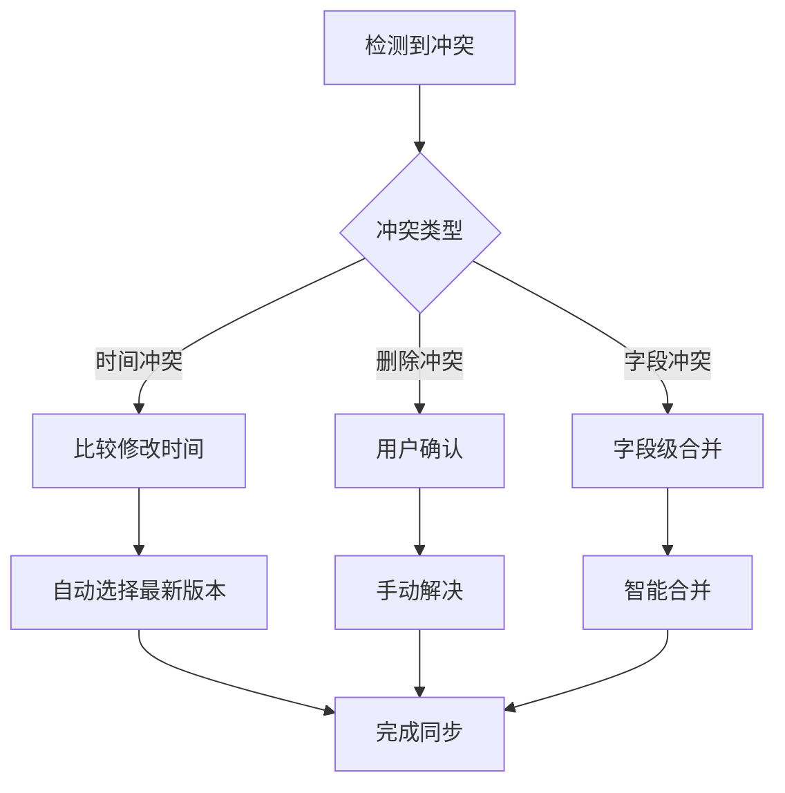

# JobView 移动端 API 设计考虑

## 执行概要

本文档分析现有 JobView 后端 API 的移动端适配性，识别移动端特有的 API 需求，并提供完整的移动端 API 设计方案。重点关注离线数据同步、推送通知服务、性能优化和移动端特有功能的 API 设计，确保移动应用能够提供流畅、高效的用户体验。

## 现有 API 移动端适配性分析

### 1. 用户认证 API 适配性

**现有接口：**
```http
POST /api/v1/auth/login       # 用户登录
POST /api/v1/auth/register    # 用户注册
POST /api/v1/auth/refresh     # Token刷新
GET  /api/v1/auth/profile     # 获取用户信息
PUT  /api/v1/auth/profile     # 更新用户信息
```

**移动端适配性评估：**

✅ **完全适配：**
- 基础登录/注册功能完整
- JWT Token 刷新机制已实现
- 用户信息管理功能齐全

⚠️ **需要增强：**
- 缺少设备绑定机制
- 没有生物识别认证支持
- 缺少多设备登录管理
- 没有登录状态同步机制

**移动端增强建议：**
```http
POST /api/v1/auth/device/register     # 设备注册
POST /api/v1/auth/biometric/setup     # 生物识别设置
GET  /api/v1/auth/sessions            # 获取登录会话列表
DELETE /api/v1/auth/sessions/{id}     # 注销特定会话
POST /api/v1/auth/logout/all          # 全设备登出
```

### 2. 投递记录 API 适配性

**现有核心接口：**
```http
GET    /api/v1/applications           # 获取所有记录
GET    /api/v1/applications/{id}      # 获取单个记录
POST   /api/v1/applications          # 创建记录
PUT    /api/v1/applications/{id}     # 更新记录
DELETE /api/v1/applications/{id}     # 删除记录
GET    /api/v1/applications/search   # 全文搜索
```

**移动端适配性评估：**

✅ **完全适配：**
- 基础 CRUD 操作完整
- 搜索功能已实现
- 分页查询支持

⚠️ **需要优化：**
- 分页加载策略需要移动端优化
- 缺少增量同步机制
- 没有冲突解决策略
- 搜索性能需要移动端优化

**移动端优化建议：**
```http
GET /api/v1/applications/sync/{timestamp}    # 增量同步
GET /api/v1/applications/lightweight        # 轻量级列表
POST /api/v1/applications/conflict/resolve  # 冲突解决
GET /api/v1/applications/search/suggest     # 搜索建议
```

### 3. 状态跟踪 API 适配性

**现有接口：**
```http
POST /api/v1/status-tracking/{id}/status      # 更新状态
GET  /api/v1/status-tracking/{id}/history     # 获取状态历史
GET  /api/v1/status-tracking/transitions     # 获取可用状态转换
```

**移动端适配性评估：**

✅ **适配良好：**
- 状态更新接口简洁高效
- 状态历史查询完整
- 状态转换规则明确

⚠️ **可以增强：**
- 批量状态更新支持
- 状态变更通知机制
- 快捷操作接口

**移动端增强建议：**
```http
POST /api/v1/status-tracking/batch        # 批量状态更新
GET  /api/v1/status-tracking/shortcuts    # 快捷操作配置
POST /api/v1/status-tracking/quick-update # 快速状态更新
```

### 4. 统计分析 API 适配性

**现有接口：**
```http
GET /api/v1/applications/statistics    # 获取统计信息
```

**移动端适配性评估：**

❌ **需要大幅优化：**
- 单一接口返回数据过多
- 没有分级统计数据
- 缺少实时统计更新
- 没有个性化统计配置

**移动端重新设计建议：**
```http
GET /api/v1/stats/summary              # 概览统计
GET /api/v1/stats/trends               # 趋势分析
GET /api/v1/stats/breakdown            # 详细分解
GET /api/v1/stats/real-time            # 实时统计
```

## 新增移动端专用 API 需求

### 1. 设备和会话管理 API

**设备管理接口：**
```http
# 设备注册和管理
POST   /api/v1/mobile/devices/register
PUT    /api/v1/mobile/devices/{device_id}
DELETE /api/v1/mobile/devices/{device_id}
GET    /api/v1/mobile/devices

# 设备推送配置
POST   /api/v1/mobile/devices/{device_id}/push-token
PUT    /api/v1/mobile/devices/{device_id}/settings
```

**接口设计详情：**

**设备注册：**
```json
POST /api/v1/mobile/devices/register
{
  "device_info": {
    "device_id": "unique_device_identifier",
    "device_type": "android",
    "os_version": "14.0",
    "app_version": "1.0.0",
    "device_model": "Pixel 8",
    "screen_size": "1080x2340"
  },
  "push_token": "fcm_token_here"
}

Response:
{
  "success": true,
  "data": {
    "device_uuid": "generated_uuid",
    "registration_time": "2025-01-15T10:30:00Z",
    "settings": {
      "notifications_enabled": true,
      "sync_frequency": "real-time"
    }
  }
}
```

### 2. 离线同步专用 API

**同步管理接口：**
```http
# 增量数据同步
GET    /api/v1/mobile/sync/incremental
POST   /api/v1/mobile/sync/upload
GET    /api/v1/mobile/sync/status
POST   /api/v1/mobile/sync/resolve-conflicts

# 离线队列管理
GET    /api/v1/mobile/offline/queue
POST   /api/v1/mobile/offline/queue/clear
POST   /api/v1/mobile/offline/queue/retry
```

**增量同步接口设计：**
```json
GET /api/v1/mobile/sync/incremental?last_sync=2025-01-15T10:00:00Z&limit=50

Response:
{
  "success": true,
  "data": {
    "applications": {
      "created": [...],
      "updated": [...],
      "deleted": [...]
    },
    "sync_metadata": {
      "current_timestamp": "2025-01-15T11:00:00Z",
      "has_more": false,
      "next_cursor": null
    },
    "conflicts": [...]
  }
}
```

**冲突解决接口：**
```json
POST /api/v1/mobile/sync/resolve-conflicts
{
  "conflicts": [
    {
      "conflict_id": "uuid",
      "resolution": "use_server", // 或 "use_client", "merge"
      "merged_data": {...} // 当 resolution 为 "merge" 时提供
    }
  ]
}
```

### 3. 推送通知 API

**通知管理接口：**
```http
# 通知配置
GET    /api/v1/mobile/notifications/settings
PUT    /api/v1/mobile/notifications/settings
POST   /api/v1/mobile/notifications/test

# 通知历史
GET    /api/v1/mobile/notifications/history
PUT    /api/v1/mobile/notifications/{id}/read
DELETE /api/v1/mobile/notifications/{id}

# 推送令牌管理
POST   /api/v1/mobile/push/token
DELETE /api/v1/mobile/push/token/{token}
```

**通知设置接口设计：**
```json
PUT /api/v1/mobile/notifications/settings
{
  "notification_types": {
    "status_reminders": {
      "enabled": true,
      "frequency": "daily",
      "quiet_hours": {
        "start": "22:00",
        "end": "08:00"
      }
    },
    "interview_reminders": {
      "enabled": true,
      "advance_time": 60 // 分钟
    },
    "weekly_reports": {
      "enabled": true,
      "day_of_week": "sunday",
      "time": "09:00"
    }
  },
  "general_settings": {
    "sound_enabled": true,
    "vibration_enabled": true,
    "led_enabled": false
  }
}
```

### 4. 移动端性能优化 API

**轻量级数据接口：**
```http
# 轻量级列表（用于快速加载）
GET /api/v1/mobile/applications/lightweight

# 分批加载详情
POST /api/v1/mobile/applications/batch-details

# 预加载数据
GET /api/v1/mobile/preload/{user_id}
```

**轻量级列表接口：**
```json
GET /api/v1/mobile/applications/lightweight?page=1&limit=20

Response:
{
  "success": true,
  "data": {
    "applications": [
      {
        "id": 123,
        "company_name": "Example Corp",
        "position_title": "Software Engineer",
        "status": "已投递",
        "application_date": "2025-01-15",
        "updated_at": "2025-01-15T10:30:00Z",
        // 只包含列表显示必需的字段
      }
    ],
    "pagination": {
      "current_page": 1,
      "total_pages": 5,
      "total_count": 95,
      "has_next": true
    }
  }
}
```

### 5. 智能功能 API

**智能建议接口：**
```http
# 自动填充建议
GET /api/v1/mobile/smart/company-suggest?q={query}
GET /api/v1/mobile/smart/position-suggest?q={query}

# 重复检测
POST /api/v1/mobile/smart/duplicate-check

# 最佳投递时间建议
GET /api/v1/mobile/smart/optimal-time

# 投递成功率预测
POST /api/v1/mobile/smart/success-prediction
```

**智能建议接口设计：**
```json
GET /api/v1/mobile/smart/company-suggest?q=goog

Response:
{
  "success": true,
  "data": {
    "suggestions": [
      {
        "company_name": "Google",
        "frequency": 15,
        "recent_positions": ["Software Engineer", "Product Manager"],
        "avg_salary_range": "20k-30k"
      },
      {
        "company_name": "Google Cloud",
        "frequency": 8,
        "recent_positions": ["Cloud Architect", "Solutions Engineer"],
        "avg_salary_range": "25k-35k"
      }
    ]
  }
}
```

## 离线数据同步策略

### 1. 同步架构设计

**同步策略层级：**
```
┌─────────────────┐
│   移动端应用    │
├─────────────────┤
│   本地 SQLite   │  ← 离线数据存储
├─────────────────┤
│   同步管理器    │  ← 数据同步逻辑
├─────────────────┤
│   冲突解决器    │  ← 冲突检测和解决
├─────────────────┤
│   网络适配器    │  ← 网络状态感知
└─────────────────┘
        ↕
┌─────────────────┐
│   后端 API      │
└─────────────────┘
```

### 2. 数据同步模型

**同步数据结构：**
```json
{
  "entity_type": "job_application",
  "entity_id": 123,
  "action": "update",
  "timestamp": "2025-01-15T10:30:00Z",
  "data": {...},
  "client_id": "mobile_device_uuid",
  "sync_version": 5,
  "checksum": "sha256_hash"
}
```

**同步状态跟踪：**
```sql
CREATE TABLE sync_status (
  id INTEGER PRIMARY KEY,
  entity_type VARCHAR(50),
  entity_id INTEGER,
  local_version INTEGER,
  server_version INTEGER,
  last_sync_time DATETIME,
  sync_status VARCHAR(20), -- 'synced', 'pending', 'conflict'
  conflict_data TEXT
);
```

### 3. 冲突解决策略

**冲突类型定义：**
1. **时间冲突：** 同一记录在不同设备上同时修改
2. **删除冲突：** 一端删除，另一端修改
3. **字段冲突：** 相同字段不同值的冲突

**冲突解决规则：**
```json
{
  "conflict_resolution_rules": {
    "timestamp_priority": {
      "enabled": true,
      "description": "最后修改时间优先"
    },
    "user_choice": {
      "enabled": true,
      "description": "用户手动选择"
    },
    "field_level_merge": {
      "enabled": true,
      "mergeable_fields": ["notes", "salary_range"],
      "non_mergeable_fields": ["status", "company_name"]
    }
  }
}
```

**冲突解决流程：**


### 4. 同步性能优化

**批量同步策略：**
```http
POST /api/v1/mobile/sync/batch
{
  "operations": [
    {
      "type": "create",
      "entity": "job_application",
      "data": {...},
      "client_id": "temp_id_1"
    },
    {
      "type": "update",
      "entity": "job_application",
      "id": 123,
      "data": {...}
    }
  ],
  "sync_metadata": {
    "device_id": "device_uuid",
    "batch_id": "batch_uuid",
    "timestamp": "2025-01-15T10:30:00Z"
  }
}
```

**差异化同步：**
```json
{
  "sync_policies": {
    "critical_data": {
      "sync_frequency": "immediate",
      "entities": ["job_applications", "user_profile"]
    },
    "reference_data": {
      "sync_frequency": "daily",
      "entities": ["status_config", "app_settings"]
    },
    "analytics_data": {
      "sync_frequency": "weekly",
      "entities": ["usage_stats", "performance_metrics"]
    }
  }
}
```

## 推送通知服务集成

### 1. 推送服务架构

**多渠道推送支持：**
```json
{
  "push_providers": {
    "fcm": {
      "enabled": true,
      "priority": 1,
      "regions": ["global"]
    },
    "xiaomi": {
      "enabled": true,
      "priority": 2,
      "regions": ["china"],
      "condition": "device.brand == 'xiaomi'"
    },
    "huawei": {
      "enabled": true,
      "priority": 2,
      "regions": ["china"],
      "condition": "device.brand == 'huawei'"
    }
  }
}
```

### 2. 通知类型和模板

**通知分类系统：**
```json
{
  "notification_categories": {
    "status_reminders": {
      "priority": "normal",
      "sound": true,
      "vibration": true,
      "templates": {
        "no_progress": "您的 {{company_name}} 投递已 {{days}} 天无进展，建议主动跟进",
        "interview_prep": "您明天有 {{company_name}} 的面试，记得准备相关材料"
      }
    },
    "system_updates": {
      "priority": "low",
      "sound": false,
      "vibration": false,
      "templates": {
        "sync_complete": "数据同步完成，共更新 {{count}} 条记录",
        "backup_reminder": "建议备份您的投递数据"
      }
    },
    "achievements": {
      "priority": "normal",
      "sound": true,
      "vibration": true,
      "templates": {
        "milestone": "恭喜！您已投递 {{count}} 家公司，再接再厉！",
        "success_rate": "您的面试成功率达到 {{rate}}%，表现优秀！"
      }
    }
  }
}
```

### 3. 智能推送策略

**推送时机优化：**
```json
{
  "smart_timing": {
    "user_active_hours": {
      "detection_method": "usage_pattern_analysis",
      "default_hours": ["09:00", "12:00", "18:00", "21:00"]
    },
    "quiet_time": {
      "weekday": {"start": "22:00", "end": "08:00"},
      "weekend": {"start": "23:00", "end": "09:00"}
    },
    "batch_notifications": {
      "enabled": true,
      "max_per_hour": 3,
      "combine_similar": true
    }
  }
}
```

**个性化推送内容：**
```http
POST /api/v1/mobile/push/personalized
{
  "user_id": 123,
  "notification_type": "status_reminder",
  "context": {
    "application_id": 456,
    "days_since_update": 7,
    "user_preferences": {
      "tone": "encouraging",
      "detail_level": "concise"
    }
  }
}
```

### 4. 推送分析和优化

**推送效果跟踪：**
```http
POST /api/v1/mobile/push/analytics
{
  "events": [
    {
      "notification_id": "uuid",
      "event_type": "delivered",
      "timestamp": "2025-01-15T10:30:00Z",
      "device_id": "device_uuid"
    },
    {
      "notification_id": "uuid",
      "event_type": "opened",
      "timestamp": "2025-01-15T10:35:00Z",
      "device_id": "device_uuid"
    }
  ]
}
```

## API 版本管理策略

### 1. 版本控制方案

**语义化版本控制：**
```http
# URL 版本控制
GET /api/v1/applications      # 稳定版本
GET /api/v2/applications      # 新版本
GET /api/v1.1/applications    # 小版本更新

# 请求头版本控制
GET /api/applications
Accept: application/vnd.jobview.v1+json

# 查询参数版本控制
GET /api/applications?api_version=1.2
```

**移动端版本策略：**
```json
{
  "api_versioning": {
    "mobile_specific": {
      "base_path": "/api/mobile/v1",
      "backward_compatibility": "2_versions",
      "deprecation_notice": "6_months"
    },
    "version_negotiation": {
      "client_min_version": "1.0",
      "client_max_version": "1.2",
      "server_version": "1.2",
      "negotiated_version": "1.2"
    }
  }
}
```

### 2. 兼容性管理

**API 兼容性矩阵：**
```json
{
  "compatibility_matrix": {
    "app_version_1.0": {
      "supported_api_versions": ["v1.0", "v1.1"],
      "deprecated_apis": [],
      "breaking_changes": []
    },
    "app_version_1.1": {
      "supported_api_versions": ["v1.1", "v1.2"],
      "deprecated_apis": ["v1.0/auth/login"],
      "breaking_changes": ["status_enum_values"]
    }
  }
}
```

**渐进式迁移策略：**
```http
# 响应中包含版本信息和迁移提示
Response Headers:
API-Version: 1.1
API-Deprecated-Version: 1.0
API-Migration-Guide: https://docs.example.com/api/migration/v1.0-to-v1.1
```

### 3. 版本发布流程

**灰度发布机制：**
```json
{
  "rollout_strategy": {
    "phases": [
      {
        "phase": "canary",
        "percentage": 5,
        "duration": "3_days",
        "target_users": "internal_beta_users"
      },
      {
        "phase": "early_adopters",
        "percentage": 20,
        "duration": "1_week",
        "target_users": "opt_in_beta_users"
      },
      {
        "phase": "general_release",
        "percentage": 100,
        "duration": "ongoing",
        "target_users": "all_users"
      }
    ]
  }
}
```

## 性能优化建议

### 1. 响应时间优化

**API 响应时间目标：**
```json
{
  "performance_targets": {
    "authentication": "< 500ms",
    "data_retrieval": "< 1000ms",
    "data_creation": "< 800ms",
    "search_queries": "< 600ms",
    "sync_operations": "< 2000ms"
  }
}
```

**缓存策略：**
```http
# 客户端缓存控制
Cache-Control: public, max-age=300, stale-while-revalidate=60

# 条件请求支持
If-Modified-Since: Wed, 15 Jan 2025 10:00:00 GMT
ETag: "v1.0-abc123"

# 响应压缩
Accept-Encoding: gzip, br
Content-Encoding: gzip
```

### 2. 数据传输优化

**响应体优化：**
```json
{
  "optimization_strategies": {
    "field_selection": {
      "endpoint": "GET /api/v1/applications?fields=id,company_name,status",
      "description": "只返回请求的字段"
    },
    "data_compression": {
      "gzip": "85% size reduction",
      "brotli": "90% size reduction"
    },
    "pagination": {
      "cursor_based": "Better performance for large datasets",
      "offset_based": "Simple implementation"
    }
  }
}
```

**批量操作优化：**
```http
# 批量获取
POST /api/v1/mobile/applications/batch-get
{
  "ids": [1, 2, 3, 4, 5],
  "fields": ["id", "company_name", "status", "updated_at"]
}

# 批量更新
POST /api/v1/mobile/applications/batch-update
{
  "updates": [
    {"id": 1, "status": "面试中"},
    {"id": 2, "notes": "Added interview feedback"}
  ]
}
```

### 3. 网络错误处理

**重试策略：**
```json
{
  "retry_policy": {
    "max_attempts": 3,
    "backoff_strategy": "exponential",
    "base_delay": 1000,
    "max_delay": 30000,
    "retry_conditions": [
      "network_timeout",
      "server_error_5xx",
      "rate_limit_429"
    ]
  }
}
```

**错误响应格式：**
```json
{
  "error": {
    "code": "VALIDATION_ERROR",
    "message": "请求参数验证失败",
    "details": [
      {
        "field": "company_name",
        "issue": "不能为空"
      }
    ],
    "retry_after": 1000,
    "documentation_url": "https://docs.example.com/api/errors#validation-error"
  }
}
```

## 安全考虑

### 1. API 安全机制

**认证和授权：**
```http
# JWT Token 认证
Authorization: Bearer <jwt_token>

# API Key 认证（用于设备识别）
X-API-Key: <device_api_key>

# 请求签名验证
X-Signature: sha256=<request_signature>
X-Timestamp: 1642248000
```

**请求签名算法：**
```javascript
// 请求签名生成
const signature = crypto.createHmac('sha256', secretKey)
  .update(method + url + timestamp + JSON.stringify(body))
  .digest('hex');
```

### 2. 数据加密和隐私

**敏感数据保护：**
```json
{
  "encryption_strategy": {
    "in_transit": {
      "protocol": "TLS 1.3",
      "cipher_suites": ["TLS_AES_256_GCM_SHA384"]
    },
    "at_rest": {
      "algorithm": "AES-256-GCM",
      "key_rotation": "quarterly"
    },
    "sensitive_fields": {
      "personally_identifiable": ["email", "phone"],
      "financial": ["salary_range"],
      "notes": ["interview_feedback"]
    }
  }
}
```

### 3. API 限流和防护

**限流策略：**
```json
{
  "rate_limiting": {
    "per_user": {
      "requests_per_minute": 100,
      "requests_per_hour": 1000
    },
    "per_device": {
      "requests_per_minute": 60,
      "concurrent_connections": 5
    },
    "per_endpoint": {
      "auth_login": "10/minute",
      "data_sync": "5/minute",
      "search": "30/minute"
    }
  }
}
```

**安全响应头：**
```http
X-Content-Type-Options: nosniff
X-Frame-Options: DENY
X-XSS-Protection: 1; mode=block
Strict-Transport-Security: max-age=31536000; includeSubDomains
Content-Security-Policy: default-src 'self'
```

## API 文档和测试

### 1. API 文档规范

**OpenAPI 3.0 规范：**
```yaml
openapi: 3.0.0
info:
  title: JobView Mobile API
  version: 1.0.0
  description: JobView 移动端专用API接口文档
servers:
  - url: https://api.jobview.com/mobile/v1
    description: 生产环境
  - url: https://staging-api.jobview.com/mobile/v1
    description: 测试环境
```

**接口文档示例：**
```yaml
paths:
  /applications/lightweight:
    get:
      summary: 获取轻量级投递记录列表
      description: 返回用于移动端列表展示的简化投递记录
      parameters:
        - name: page
          in: query
          schema:
            type: integer
            default: 1
        - name: limit
          in: query
          schema:
            type: integer
            default: 20
            maximum: 100
      responses:
        '200':
          description: 成功获取数据
          content:
            application/json:
              schema:
                $ref: '#/components/schemas/LightweightApplicationList'
```

### 2. API 测试策略

**测试分类：**
```json
{
  "testing_strategy": {
    "unit_tests": {
      "coverage_target": "90%",
      "focus": "business_logic_validation"
    },
    "integration_tests": {
      "coverage_target": "80%",
      "focus": "api_endpoint_functionality"
    },
    "end_to_end_tests": {
      "coverage_target": "60%",
      "focus": "critical_user_journeys"
    },
    "performance_tests": {
      "load_testing": "1000_concurrent_users",
      "stress_testing": "2000_concurrent_users",
      "endurance_testing": "24_hour_continuous"
    }
  }
}
```

**自动化测试配置：**
```javascript
// API 测试示例
describe('Mobile API Tests', () => {
  test('应该返回轻量级投递记录列表', async () => {
    const response = await request(app)
      .get('/mobile/v1/applications/lightweight')
      .set('Authorization', `Bearer ${validToken}`)
      .query({ page: 1, limit: 10 });

    expect(response.status).toBe(200);
    expect(response.body.data.applications).toHaveLength(10);
    expect(response.body.data.pagination).toHaveProperty('has_next');
  });
});
```

## 结论

JobView 移动端 API 设计需要在现有 API 基础上进行针对性优化和扩展。通过引入离线同步机制、推送通知服务、性能优化接口和移动端特有功能，可以为移动应用提供完整、高效、安全的 API 支持。

关键实施要点：
1. **渐进式改进：** 在现有 API 基础上逐步增加移动端特性
2. **性能优先：** 重点优化响应时间和数据传输效率
3. **离线支持：** 完整的离线数据同步和冲突解决机制
4. **智能化：** 推送通知和智能建议提升用户体验
5. **安全可靠：** 全面的安全机制和错误处理策略

通过合理的 API 设计和实施计划，可以确保 JobView Android 应用获得优秀的性能表现和用户体验。