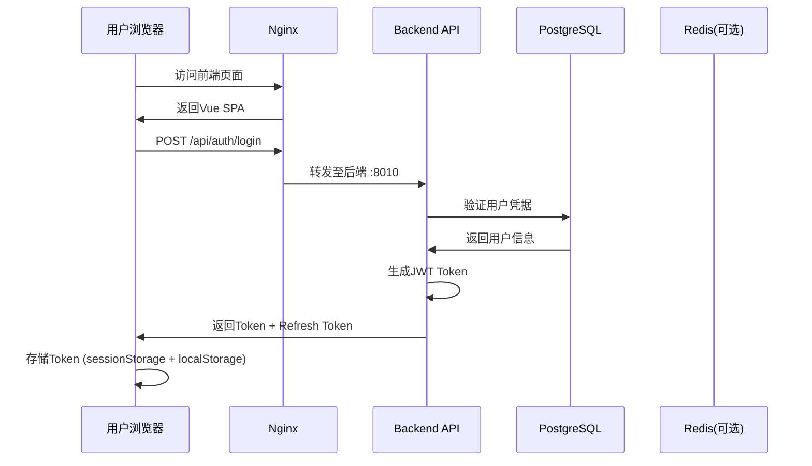

# JobView 系统数据流转与Docker部署指南

## 目录
1. [系统架构概览](#系统架构概览)
2. [数据流转路线详解](#数据流转路线详解)
3. [Docker容器化部署方案](#docker容器化部署方案)
4. [云服务器部署步骤](#云服务器部署步骤)
5. [域名配置与上线](#域名配置与上线)
6. [生产环境优化](#生产环境优化)

---

## 系统架构概览

JobView 是一个现代化的求职投递记录管理系统，采用前后端分离架构：

```
┌─────────────────────────────────────────────────────────────┐
│                     JobView 系统架构                          │
├─────────────────────────────────────────────────────────────┤
│  用户层                                                       │
│  ├── Web浏览器 (Vue 3 SPA)                                  │
│  └── Chrome扩展插件                                          │
├─────────────────────────────────────────────────────────────┤
│  前端应用层 (Nginx)                                          │
│  ├── 静态资源服务                                            │
│  └── API反向代理 (/api -> backend:8010)                     │
├─────────────────────────────────────────────────────────────┤
│  后端服务层 (Go + Gin/Gorilla)                               │
│  ├── RESTful API                                            │
│  ├── JWT认证服务                                            │
│  ├── 业务逻辑处理                                           │
│  └── 数据验证与转换                                         │
├─────────────────────────────────────────────────────────────┤
│  数据持久层 (PostgreSQL)                                     │
│  ├── 用户数据                                               │
│  ├── 投递记录                                               │
│  ├── 状态跟踪                                               │
│  └── 系统配置                                               │
└─────────────────────────────────────────────────────────────┘
```

---

## 数据流转路线详解

### 1. 用户认证流程



### 2. 业务数据流转

#### 2.1 创建投递记录
```
前端组件 → API请求(/api/v1/applications) → 后端Handler → Service层 → Database层 → PostgreSQL
    ↑                                                                               ↓
    └──────────────────── 返回创建结果 (JSON) ←─────────────────────────────────┘
```

#### 2.2 状态更新流程
```
状态更新组件 → 批量更新API → StatusTrackingService → 事务处理 → 状态历史记录
                                        ↓
                              状态流转验证(StatusConfig)
                                        ↓
                              更新主记录 + 创建历史记录
```

#### 2.3 数据查询流程
```
列表/看板视图 → 分页查询API →
    ├── 权限验证(JWT)
    ├── 参数验证
    ├── 构建查询条件
    ├── 执行数据库查询(带索引优化)
    └── 返回格式化数据
```

### 3. 前后端通信协议

#### 3.1 请求格式
```typescript
// 前端请求拦截器配置
baseURL: '/api'
headers: {
  'Authorization': 'Bearer <access_token>',
  'Content-Type': 'application/json'
}
```

#### 3.2 响应格式
```json
{
  "code": 200,
  "message": "success",
  "data": {
    // 业务数据
  }
}
```

#### 3.3 Token刷新机制
- Access Token: 存储在sessionStorage，有效期2小时
- Refresh Token: 存储在localStorage，有效期7天
- 401响应时自动刷新，支持请求队列

---

## Docker容器化部署方案

### 1. 创建Dockerfile文件

#### Backend Dockerfile (`backend/Dockerfile`)
```dockerfile
# 构建阶段
FROM golang:1.24.5-alpine AS builder

# 安装必要的工具
RUN apk add --no-cache git

# 设置工作目录
WORKDIR /app

# 复制go mod文件
COPY go.mod go.sum ./

# 下载依赖
RUN go mod download

# 复制源代码
COPY . .

# 构建应用
RUN CGO_ENABLED=0 GOOS=linux go build -a -installsuffix cgo -o main cmd/main.go

# 运行阶段
FROM alpine:latest

# 安装必要的运行时依赖
RUN apk --no-cache add ca-certificates tzdata

# 设置时区
ENV TZ=Asia/Shanghai

WORKDIR /root/

# 从构建阶段复制二进制文件
COPY --from=builder /app/main .
COPY --from=builder /app/migrations ./migrations

# 暴露端口
EXPOSE 8010

# 运行应用
CMD ["./main"]
```

#### Frontend Dockerfile (`frontend/Dockerfile`)
```dockerfile
# 构建阶段
FROM node:20-alpine AS builder

WORKDIR /app

# 复制package文件
COPY package*.json ./

# 安装依赖
RUN npm ci

# 复制源代码
COPY . .

# 构建生产版本
RUN npm run build

# 运行阶段
FROM nginx:alpine

# 复制nginx配置
COPY nginx.conf /etc/nginx/nginx.conf

# 复制构建产物
COPY --from=builder /app/dist /usr/share/nginx/html

# 暴露端口
EXPOSE 80

CMD ["nginx", "-g", "daemon off;"]
```

### 2. Nginx配置文件 (`frontend/nginx.conf`)
```nginx
worker_processes auto;
error_log /var/log/nginx/error.log warn;
pid /var/run/nginx.pid;

events {
    worker_connections 1024;
}

http {
    include /etc/nginx/mime.types;
    default_type application/octet-stream;

    log_format main '$remote_addr - $remote_user [$time_local] "$request" '
                    '$status $body_bytes_sent "$http_referer" '
                    '"$http_user_agent" "$http_x_forwarded_for"';

    access_log /var/log/nginx/access.log main;

    sendfile on;
    tcp_nopush on;
    tcp_nodelay on;
    keepalive_timeout 65;
    gzip on;
    gzip_types text/plain text/css application/json application/javascript text/xml application/xml application/xml+rss text/javascript;

    server {
        listen 80;
        server_name localhost;

        root /usr/share/nginx/html;
        index index.html;

        # 前端路由
        location / {
            try_files $uri $uri/ /index.html;
        }

        # API代理
        location /api/ {
            proxy_pass http://jobview-backend:8010;
            proxy_http_version 1.1;
            proxy_set_header Upgrade $http_upgrade;
            proxy_set_header Connection 'upgrade';
            proxy_set_header Host $host;
            proxy_set_header X-Real-IP $remote_addr;
            proxy_set_header X-Forwarded-For $proxy_add_x_forwarded_for;
            proxy_set_header X-Forwarded-Proto $scheme;
            proxy_cache_bypass $http_upgrade;
            proxy_connect_timeout 60s;
            proxy_send_timeout 60s;
            proxy_read_timeout 60s;
        }

        # 静态资源缓存
        location ~* \.(jpg|jpeg|png|gif|ico|css|js|svg|woff|woff2|ttf|eot)$ {
            expires 30d;
            add_header Cache-Control "public, immutable";
        }
    }
}
```

### 3. Docker Compose配置 (`docker-compose.yml`)
```yaml
version: '3.8'

services:
  # PostgreSQL数据库
  postgres:
    image: postgres:15-alpine
    container_name: jobview-db
    restart: unless-stopped
    environment:
      POSTGRES_DB: jobview_db
      POSTGRES_USER: jobview
      POSTGRES_PASSWORD: ${DB_PASSWORD:-your_secure_password}
      PGDATA: /var/lib/postgresql/data/pgdata
    ports:
      - "5432:5432"
    volumes:
      - postgres_data:/var/lib/postgresql/data
    networks:
      - jobview-network
    healthcheck:
      test: ["CMD-SHELL", "pg_isready -U jobview -d jobview_db"]
      interval: 10s
      timeout: 5s
      retries: 5

  # 后端服务
  backend:
    build:
      context: ./backend
      dockerfile: Dockerfile
    container_name: jobview-backend
    restart: unless-stopped
    environment:
      DB_HOST: postgres
      DB_PORT: 5432
      DB_USER: jobview
      DB_PASSWORD: ${DB_PASSWORD:-your_secure_password}
      DB_NAME: jobview_db
      JWT_SECRET: ${JWT_SECRET:-your_jwt_secret_at_least_32_characters_long}
      PORT: 8010
    ports:
      - "8010:8010"
    depends_on:
      postgres:
        condition: service_healthy
    networks:
      - jobview-network
    volumes:
      - ./backend/uploads:/root/uploads

  # 前端服务
  frontend:
    build:
      context: ./frontend
      dockerfile: Dockerfile
      args:
        VITE_API_BASE: ${VITE_API_BASE:-/api}
    container_name: jobview-frontend
    restart: unless-stopped
    ports:
      - "80:80"
      - "443:443"
    depends_on:
      - backend
    networks:
      - jobview-network
    volumes:
      - ./ssl:/etc/nginx/ssl:ro

networks:
  jobview-network:
    driver: bridge

volumes:
  postgres_data:
```

### 4. 环境变量配置 (`.env`)
```env
# 数据库配置
DB_PASSWORD=your_secure_database_password
DB_HOST=postgres
DB_PORT=5432
DB_USER=jobview
DB_NAME=jobview_db

# JWT配置
JWT_SECRET=your_super_secret_jwt_key_at_least_32_chars

# API配置
VITE_API_BASE=/api
PORT=8010

# 生产环境域名
DOMAIN=jobview.yourdomain.com
```

---

## 云服务器部署步骤

### 1. 服务器准备

```bash
# 1. 更新系统
sudo apt update && sudo apt upgrade -y

# 2. 安装Docker
curl -fsSL https://get.docker.com -o get-docker.sh
sudo sh get-docker.sh

# 3. 安装Docker Compose
sudo curl -L "https://github.com/docker/compose/releases/latest/download/docker-compose-$(uname -s)-$(uname -m)" -o /usr/local/bin/docker-compose
sudo chmod +x /usr/local/bin/docker-compose

# 4. 创建项目目录
sudo mkdir -p /opt/jobview
cd /opt/jobview
```

### 2. 部署应用

```bash
# 1. 克隆代码仓库
git clone https://github.com/yourusername/jobview.git .

# 2. 创建环境变量文件
cp .env.example .env
# 编辑.env文件，设置生产环境的密码和配置

# 3. 构建并启动容器
docker-compose up -d --build

# 4. 查看容器状态
docker-compose ps

# 5. 查看日志
docker-compose logs -f
```

### 3. 配置防火墙

```bash
# 开放必要端口
sudo ufw allow 22/tcp    # SSH
sudo ufw allow 80/tcp    # HTTP
sudo ufw allow 443/tcp   # HTTPS
sudo ufw enable
```

---

## 域名配置与上线

### 1. 域名解析配置

在域名服务商控制台添加A记录：
```
类型: A
主机记录: jobview (或 @)
记录值: 你的服务器IP
TTL: 600
```

### 2. 配置SSL证书（使用Let's Encrypt）

```bash
# 1. 安装Certbot
sudo apt install certbot python3-certbot-nginx -y

# 2. 申请证书
sudo certbot certonly --standalone -d jobview.yourdomain.com

# 3. 证书将保存在
# /etc/letsencrypt/live/jobview.yourdomain.com/
```

### 3. 更新Nginx配置支持HTTPS

创建 `frontend/nginx-ssl.conf`:
```nginx
worker_processes auto;

events {
    worker_connections 1024;
}

http {
    include /etc/nginx/mime.types;
    default_type application/octet-stream;

    # 日志配置
    access_log /var/log/nginx/access.log;
    error_log /var/log/nginx/error.log;

    # 性能优化
    sendfile on;
    tcp_nopush on;
    tcp_nodelay on;
    keepalive_timeout 65;

    # Gzip压缩
    gzip on;
    gzip_vary on;
    gzip_min_length 1024;
    gzip_types text/plain text/css text/xml text/javascript application/json application/javascript application/xml+rss application/rss+xml application/atom+xml image/svg+xml text/javascript application/x-javascript application/x-font-ttf application/vnd.ms-fontobject font/opentype;

    # HTTP重定向到HTTPS
    server {
        listen 80;
        server_name jobview.yourdomain.com;
        return 301 https://$server_name$request_uri;
    }

    # HTTPS服务器配置
    server {
        listen 443 ssl http2;
        server_name jobview.yourdomain.com;

        # SSL证书配置
        ssl_certificate /etc/nginx/ssl/fullchain.pem;
        ssl_certificate_key /etc/nginx/ssl/privkey.pem;

        # SSL安全配置
        ssl_protocols TLSv1.2 TLSv1.3;
        ssl_ciphers HIGH:!aNULL:!MD5;
        ssl_prefer_server_ciphers on;
        ssl_session_cache shared:SSL:10m;
        ssl_session_timeout 10m;

        # 安全头部
        add_header Strict-Transport-Security "max-age=31536000; includeSubDomains" always;
        add_header X-Frame-Options "SAMEORIGIN" always;
        add_header X-Content-Type-Options "nosniff" always;
        add_header X-XSS-Protection "1; mode=block" always;

        root /usr/share/nginx/html;
        index index.html;

        # 前端路由
        location / {
            try_files $uri $uri/ /index.html;
        }

        # API代理
        location /api/ {
            proxy_pass http://jobview-backend:8010;
            proxy_http_version 1.1;
            proxy_set_header Upgrade $http_upgrade;
            proxy_set_header Connection 'upgrade';
            proxy_set_header Host $host;
            proxy_set_header X-Real-IP $remote_addr;
            proxy_set_header X-Forwarded-For $proxy_add_x_forwarded_for;
            proxy_set_header X-Forwarded-Proto $scheme;
            proxy_cache_bypass $http_upgrade;

            # 超时配置
            proxy_connect_timeout 60s;
            proxy_send_timeout 60s;
            proxy_read_timeout 60s;
        }

        # 静态资源缓存
        location ~* \.(jpg|jpeg|png|gif|ico|css|js|svg|woff|woff2|ttf|eot)$ {
            expires 30d;
            add_header Cache-Control "public, immutable";
        }
    }
}
```

### 4. 更新Docker Compose以支持SSL

```yaml
# 在docker-compose.yml中更新frontend服务
frontend:
  build:
    context: ./frontend
    dockerfile: Dockerfile
  container_name: jobview-frontend
  restart: unless-stopped
  ports:
    - "80:80"
    - "443:443"
  volumes:
    - /etc/letsencrypt/live/jobview.yourdomain.com/fullchain.pem:/etc/nginx/ssl/fullchain.pem:ro
    - /etc/letsencrypt/live/jobview.yourdomain.com/privkey.pem:/etc/nginx/ssl/privkey.pem:ro
    - ./frontend/nginx-ssl.conf:/etc/nginx/nginx.conf:ro
  depends_on:
    - backend
  networks:
    - jobview-network
```

---

## 生产环境优化

### 1. 数据库优化

```sql
-- 创建必要的索引
CREATE INDEX idx_applications_user_id ON job_applications(user_id);
CREATE INDEX idx_applications_status ON job_applications(status);
CREATE INDEX idx_applications_created_at ON job_applications(created_at DESC);
CREATE INDEX idx_applications_company ON job_applications(company);
CREATE INDEX idx_composite_user_status ON job_applications(user_id, status);
```

### 2. 后端配置优化

创建 `backend/.env.production`:
```env
# 生产环境配置
DB_MAX_IDLE_CONNS=10
DB_MAX_OPEN_CONNS=100
DB_CONN_MAX_LIFETIME=3600

# 启用GZIP
ENABLE_GZIP=true

# 日志级别
LOG_LEVEL=info

# 限流配置
RATE_LIMIT_REQUESTS=100
RATE_LIMIT_DURATION=1m
```

### 3. 监控和日志

#### 3.1 配置日志收集
```bash
# 创建日志目录
sudo mkdir -p /var/log/jobview

# 配置日志轮转
sudo cat > /etc/logrotate.d/jobview << EOF
/var/log/jobview/*.log {
    daily
    rotate 14
    compress
    delaycompress
    notifempty
    create 0640 root root
    sharedscripts
    postrotate
        docker-compose restart frontend backend
    endscript
}
EOF
```

#### 3.2 健康检查脚本
```bash
#!/bin/bash
# health-check.sh

# 检查后端API
curl -f http://localhost:8010/api/auth/health || exit 1

# 检查数据库连接
docker exec jobview-db pg_isready -U jobview || exit 1

# 检查前端服务
curl -f http://localhost || exit 1

echo "All services are healthy"
```

### 4. 自动备份

```bash
#!/bin/bash
# backup.sh

# 设置变量
BACKUP_DIR="/backup/jobview"
DATE=$(date +%Y%m%d_%H%M%S)
DB_CONTAINER="jobview-db"

# 创建备份目录
mkdir -p $BACKUP_DIR

# 备份数据库
docker exec $DB_CONTAINER pg_dump -U jobview jobview_db | gzip > $BACKUP_DIR/db_backup_$DATE.sql.gz

# 保留最近7天的备份
find $BACKUP_DIR -name "db_backup_*.sql.gz" -mtime +7 -delete

# 备份上传的文件
tar -czf $BACKUP_DIR/uploads_backup_$DATE.tar.gz /opt/jobview/backend/uploads

echo "Backup completed: $DATE"
```

添加到crontab:
```bash
# 每天凌晨2点执行备份
0 2 * * * /opt/jobview/scripts/backup.sh >> /var/log/jobview/backup.log 2>&1
```

### 5. 性能监控

使用Docker自带的监控:
```bash
# 查看容器资源使用
docker stats

# 查看具体容器日志
docker-compose logs -f backend

# 数据库性能监控
docker exec jobview-db psql -U jobview -d jobview_db -c "SELECT * FROM pg_stat_activity;"
```

---

## 故障排查

### 常见问题及解决方案

1. **数据库连接失败**
   ```bash
   # 检查数据库容器状态
   docker-compose ps postgres
   # 查看数据库日志
   docker-compose logs postgres
   ```

2. **后端服务无法启动**
   ```bash
   # 检查环境变量
   docker-compose config
   # 重新构建
   docker-compose build --no-cache backend
   ```

3. **前端页面404**
   ```bash
   # 检查nginx配置
   docker exec jobview-frontend nginx -t
   # 重启前端服务
   docker-compose restart frontend
   ```

4. **SSL证书问题**
   ```bash
   # 更新证书
   sudo certbot renew
   # 重启nginx
   docker-compose restart frontend
   ```

---

## 维护和更新

### 1. 更新应用
```bash
cd /opt/jobview
git pull origin main
docker-compose down
docker-compose up -d --build
```

### 2. 数据库迁移
```bash
# 执行迁移
docker exec jobview-backend ./main migrate
```

### 3. 清理旧镜像
```bash
docker system prune -a --volumes
```

---

## 安全建议

1. **定期更新依赖**
   - 使用 `npm audit` 检查前端依赖
   - 使用 `go mod tidy` 更新后端依赖

2. **配置防火墙规则**
   - 只开放必要端口
   - 使用fail2ban防止暴力破解

3. **数据库安全**
   - 使用强密码
   - 定期备份
   - 限制数据库访问IP

4. **监控和告警**
   - 配置服务监控
   - 设置异常告警
   - 定期查看日志

---

## 总结

本指南提供了JobView系统从开发到生产环境的完整部署流程。通过Docker容器化，可以确保应用在不同环境中的一致性，简化部署和维护工作。遵循本指南，您可以快速将JobView部署到云服务器并通过自定义域名对外提供服务。

如有问题，请参考项目文档或提交Issue。